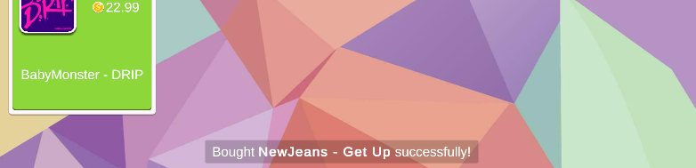

# Installation



### Check requirements

UI Manager requires **Unity 6** or later.



### Install Object Pool



1. Open **Window → Package Manager**.
2. Click the **+** icon.
3. Select **Add package from git URL...**.
4. Paste this URL:

```
https://github.com/vanhaodev/unity-object-pool.git?path=Exported/com.vanhaodev.objectpool#1.0.1
```



1. Open `Packages/manifest.json`.
2. Add this entry:

```json
"com.vanhaodev.objectpool": "https://github.com/vanhaodev/unity-object-pool.git?path=Exported/com.vanhaodev.objectpool#1.0.1"
```





### Install UI Manager



Paste this URL into Package Manager:

<pre><code><strong>https://github.com/vanhaodev/unity-ui-manager.git?path=Exported/com.vanhaodev.uimanager#1.0.0
</strong></code></pre>



1. Open `Packages/manifest.json`.
2. Add this entry:

```json
"com.vanhaodev.uimanager": "https://github.com/vanhaodev/unity-ui-manager.git?path=Exported/com.vanhaodev.uimanager#1.0.0"
```





### Import sample

1. Open **Window → Package Manager**.
2. Select **UI Manager** from the package list.
3. Open the **Samples** tab.
4. Click **Import** on **K-pop Shop**.


This sample shows the main UI Manager features and helps you get started faster.


<figure><figcaption></figcaption></figure>

<figure><figcaption></figcaption></figure>


